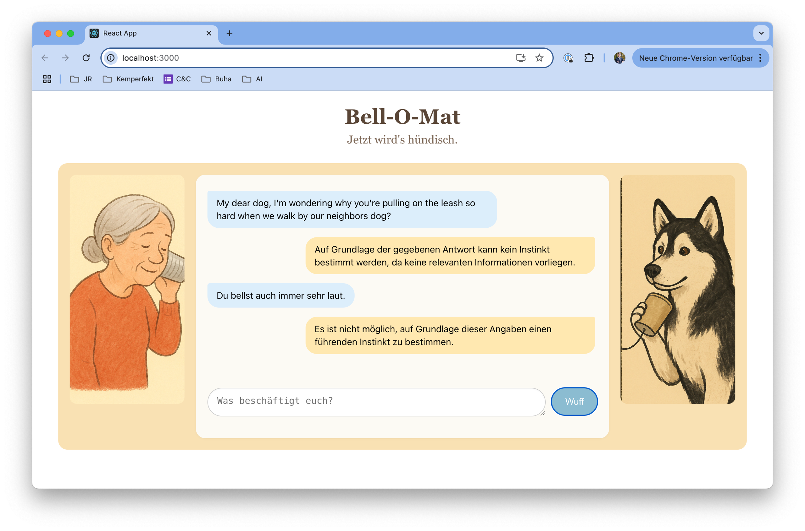

# DogBot UI

This is the frontend interface for DogBot — an early-stage AI assistant that helps humans understand their dogs through empathic dialogue, grounded in instinct theory and behavioral patterns. Built with React, the UI simulates a direct, playful line of communication between human and dog.

---

## Concept

DogBot acts as a translator between species. The interface lets users describe a problem ("Why does my dog bark at children?"), and the agent responds from the dog's perspective. The metaphor: the dog is speaking into a cup-and-string phone — and the human is listening.

The interaction is designed to:
- Encourage curiosity, not control
- Emphasize emotional tone over robotic precision
- Create a non-judgmental space to explore behavior

---

## Screenshot

---

## Features

- Two-pane layout: human on the left, dog on the right
- Animated slot-machine metaphor for human–dog pairs
- One-click message submission via the “Wuff” button
- Clear visual separation of user messages and agent responses
- Designed for mobile and desktop

---

## Tech Stack

- React (Create React App base)
- Styled with custom components (no framework)
- Integrates with DogBot agent backend via local API

---

## Status

This UI is under active development and currently runs locally. It's designed as part of a multi-repo project exploring emotionally intelligent LLM agents.

---

## Related Repositories

- [dogbot-app](https://github.com/kemperfekt/dogbot-app) — CLI backend for agent logic and GPT interaction
- [dogbot-agent](https://github.com/kemperfekt/dogbot-agent) — Web-accessible backend
- [dogbot-ops](https://github.com/kemperfekt/dogbot-ops) — JSON data and generation scripts

---

## License

To be defined.

---

*This project was created with GPT-4 — prompts engineered by a humble human.*
